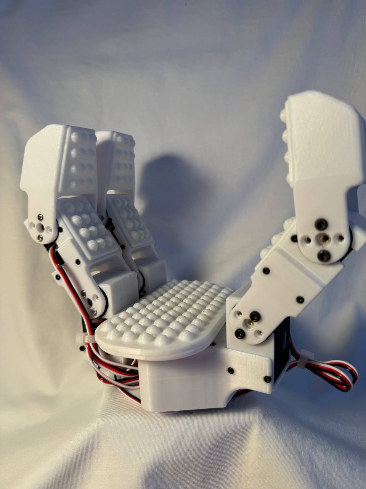
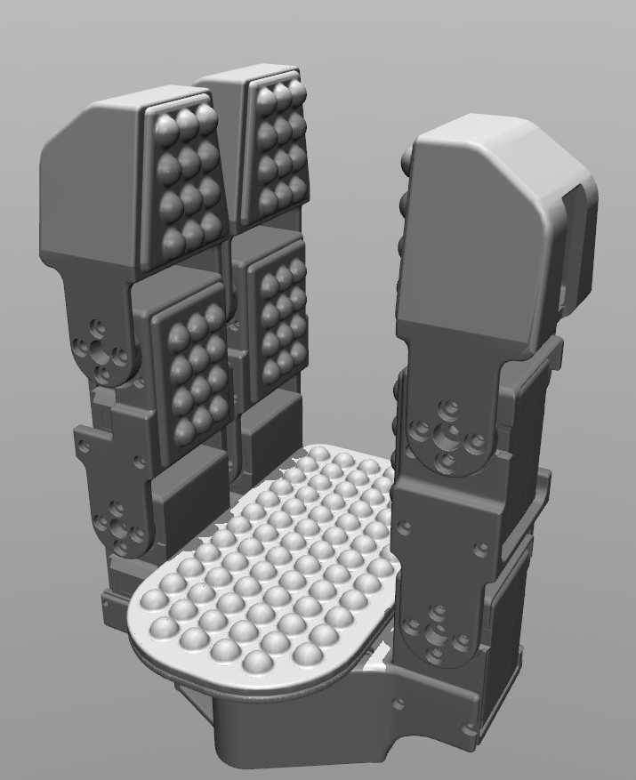
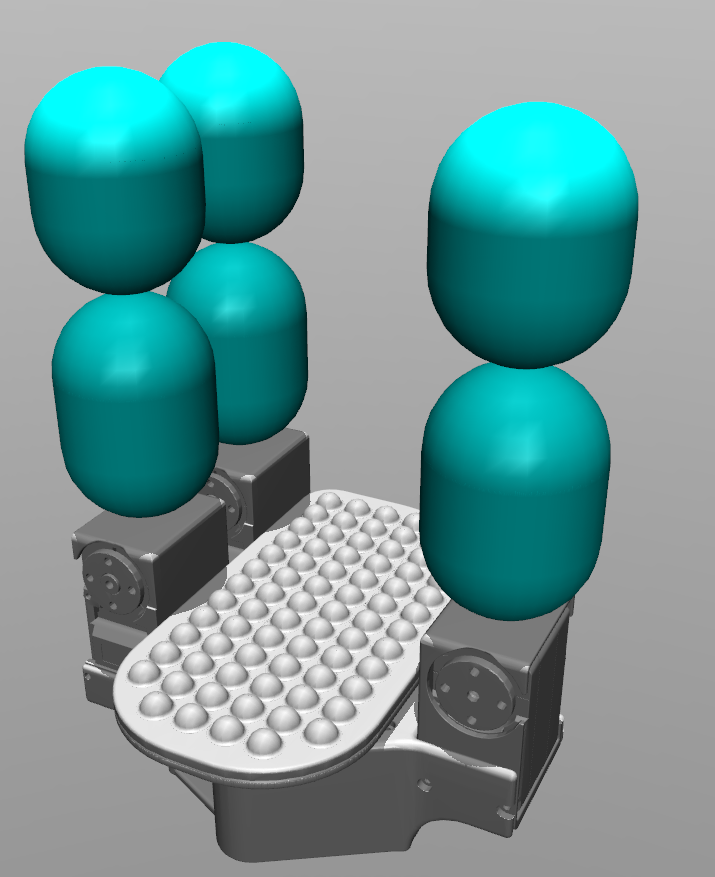
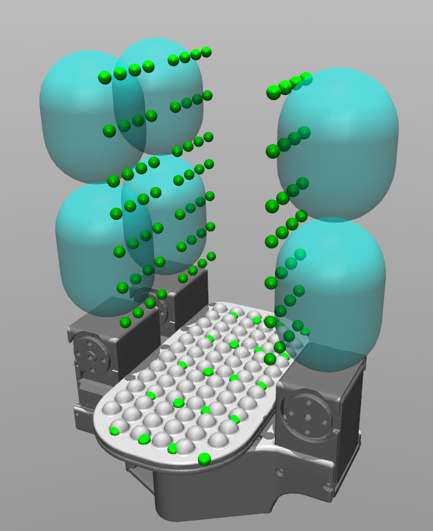
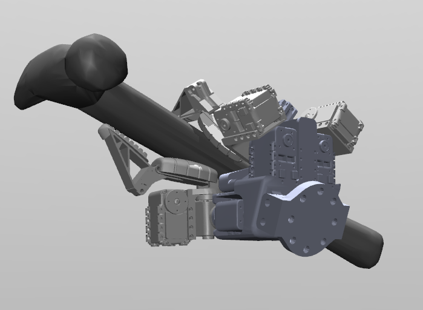
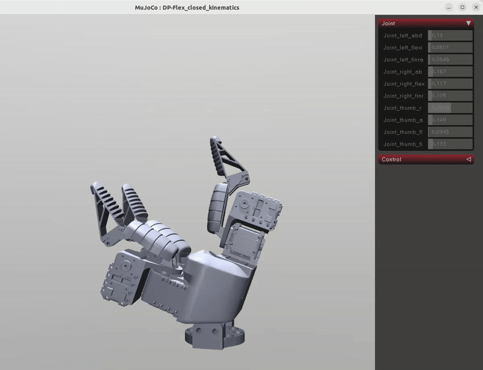

# Grasp poses generation for robotic hand
In this project, it is proposed to generate various poses for grasping objects.

As a robotic hand, we use a three-fingered gripper with 7 DoF (in the picture below):



## INSTALLATION
### Preparation
We use Docker. For correct working with GPU on Docker you need install [NVIDIA Container Toolkit](https://docs.nvidia.com/datacenter/cloud-native/container-toolkit/latest/install-guide.html). It is installed in the host.

### Docker Container Creation
So let's start by creating a container.
1) Clone this repo to your system
```bash
git clone https://github.com/BE2R-Lab-RND-AI-Grasping/DexGraspNet.git
```
3) Go to the root folder of the repository and build a Docker container using the following command:
```bash
docker build --pull --rm -f 'Dockerfile' -t 'dexgraspnet:latest' '.'
```
3) To run this code in VS Code, use the `Reopen in Container` function.
4) When starting the container for the first time, you need to install TorchSDF (TorchSDF is a custom version of Kaolin)
```bash
cd thirdparty
git clone https://github.com/wrc042/TorchSDF.git
cd TorchSDF
bash install.sh
```
### Installing dependencies
```bash
conda install pytorch3d
conda install transforms3d
conda install trimesh
conda install plotly

pip install urdf_parser_py
pip install scipy

pip install networkx  # soft dependency for trimesh
conda install rtree  # soft dependency for trimesh
```
> `Pytorch Kinematics` was already installed during creating container.

# HAND MODEL PREAPRATION

## THE CORRECT XML MODEL



* All meshes must be in the assets folder in the .stl format.
* Give names to all `<body>`, `<joint>`, `<mesh>` and .stl files with proper understandable names.
* Specify a type for each `<geom>`.
* <joint> must contain the parameters `name` and `range` (even if the `range` is specified in `<default>`)
* All other general parameters should be set to <default>.
* Set the angles in radians and the path to meshes in this way: `<compiler angle="radian" meshdir="./mjcf/assets/YOUR_HAND_NAME/"/>`
* If the mechanism has a closed kinematics (there is `<equality>` in the code), you need to open it.
* The mesh folder should contain only the files used in the model.

## MAKE A SIMPLIFIED XML MODEL WITH CAPSULES INSTEAD OF MESHES FOR CONTACT BODIES

To accelerate the generation, we will replace some of the hand parts with primitives such as capsules:



Instead of :

```bash
<geom quat="1 1 0 0" type="mesh" mesh="mideal_finger_first" pos="0.05 -0.1 -0.009" />
```

Write this:

```bash
<geom quat="1 1 0 0" type="capsule" size="0.012 0.008" pos="-0.005 0.025 -0.009"/>
```

The size parameter specifies the radius and half the length of the cylindrical part of the capsule (excluding the hemispheres at the ends).

## CONTACT POINTS CREATION

To implement the differential force closer estimation method, you must define the contact points on the finger surfaces that interact with objects.



You can use `contact_points_creation.py`:

```text
grasp_generation_egorhand_edited_hand/
│
├── contact_points/               
│   ├── creation_Python/      
│   
```

In order to visualize the received contact points along with the hands models meshes, run the file `vizualization_contact_points.py` in the same directory.

Create a file `contact_points_YOUR_HAND_NAME.json` with contact points on the contact surfaces of the bodies. The list consists of body names. Leave empty lists for bodies that are not involved in the contact. You must add a suffix `_child` to the body's name if it is not the first body in the model tree. 

```bash
{
  "palm":[[x,y,z],[x,y,z]...,[x,y,z]],
  "finger_1_link_child":[[x,y,z],[x,y,z]...,[x,y,z]],
  "finger_2_link_child":[], # if not involved in the contact
  ...
  "finger_N_link_child":[[x,y,z],[x,y,z]...,[x,y,z]]
}
```

# GRASP GENERATION
This code generates different optimized hand poses for objects and saves these values to an .npy file (a separate file for each object). These files are saved in the `data/graspdata` folder.

> Full dataset and object meshes you can find [HERE](https://mirrors.pku.edu.cn/dl-release/DexGraspNet-ICRA2023/). Files from `dexgraspnet.tar.gz` put to the folder `data/dataset`, Files from `meshdata.tar.gz` put to the folder `data/meshdata`

You should have the container running now. Run file:
```bash
cd grasp_generation/
export CUDA_VISIBLE_DEVICES=0
python scripts/generate_grasps.py --all
```
> We have one GPU, so `CUDA_VISIBLE_DEVICES=0`, if you have more GPUs write it in this form `export CUDA_VISIBLE_DEVICES=x,x,x` (instead `x` use your GPUs ID).

> The generation process takes a lot of time. It's fine if the progress bar shows 0%. For faster generation, you can leave several objects in the 'data/meshdata` folder.

> Adjust parameters `batch_size_each` to get the desired amount of data. Turn down `max_total_batch_size` if CUDA runs out of memory. Remember to change the random seed `seed` to get different results. Other numeric parameters are magical and we don't recommend tuning them.

# GRASP GENERATION WITH CONFIGURATION

1) Go to the folder 
```bash 
cd grasp_generation 
```

2) Specify on which device to generate (0 if there is one graphics card)
```bash
export CUDA_VISIBLE_DEVICES=0 
```

3) Run the generation with the necessary parameters 
```bash
python scripts/generate_grasps.py --hand_name DIP-Flex_opened_kinematics --all
```

**Configuration parameters:**

* Hand name: `--hand_name {YOUR_NAME}`

* Generation for one specific object: `--object_code_list {object_0}`

* Generation for several specific objects: `--object_code_list {object_0} {object_1} {object_2}`

* Number of poses: `--batch_size_each {N}`

* Number of iterations: `--n_iter {N}`

EXAMPLE: `python scripts/generate_grasps.py --hand_name DIP-Flex_opened_kinematics --batch_size_each 100 --n_iter 1000 --object_code_list hummer_0 pliers_0 screwdriver_0`

## Data results
Each file like `core-bottle-1a7ba1f4c892e2da30711cdbdbc73924.npy` contains a list of data dicts. Each dict represents one synthesized grasp:
* scale: The scale of the object.
* qpos: The final grasp pose g=(T,R,θ), which is logged as a dict:
 * WRJTx,WRJTy,WRJTz: Translations in meters.
 * WRJRx,WRJRy,WRJRz: Rotations in euler angles, following the xyz convention.
 * robot0:XXJn: Articulations passed to the forward kinematics system.
* qpos_st: The initial grasp pose logged like qpos. This entry will be removed after grasp validation.
* energy,E_fc,E_dis,E_pen,E_spen,E_joints: Final energy terms. These entries will be removed after grasp validation.

## Result visualization
To visualize the obtained grasping poses, we will transfer the generated position data of all joints to the original hand XML and render it in Mujoco.

You can do it with file `mujoco_qpos.ipynb` in the directory:

```text
grasp_generation_egorhand_edited_hand/
│
├── mujoco_tests/               
│   ├── mujoco_qpos/      
│   
```



In this image, the hand is not perfectly gripping the hammer. It is necessary to specify the contact points on the hand more precisely and perform more optimization iterations. **Work is currently underway on this.**

A sequence of generated roses:




## Error Solving
If the `divide by zero` error appears, replace the 'v = (d1[is_ab] / (d1[is_ab] - d3[is_ab])).reshape((-1, 1))' in the `triangles.py`:
```bash
denom = d1[is_ab] - d3[is_ab]
denom = np.where(np.abs(denom) < 1e-8, 1e-8, denom)  # Replacing values that are too small
v = (d1[is_ab] / denom).reshape((-1, 1))
```

# QUICK EXAMPLE
In this example, you do not need to follow the steps described above (create a container, etc.)
There are some objects, a hand (shadowhand), and pre-generated hand poses for this object are just loaded. The grasp pose is visualized by the `Trimesh` library.

```bash
conda create -n your_env python=3.7
conda activate your_env

# for quick example, cpu version is OK.
conda install pytorch cpuonly -c pytorch
conda install ipykernel
conda install transforms3d
conda install trimesh
pip install pyyaml
pip install lxml

cd thirdparty/pytorch_kinematics
pip install -e .
```

Then you can run `grasp_generation/quick_example.ipynb`.

> For the full DexGraspNet dataset, go to our [project page](https://pku-epic.github.io/DexGraspNet/) for download links. Decompress dowloaded packages and link (or move) them to corresponding path in `data`.
