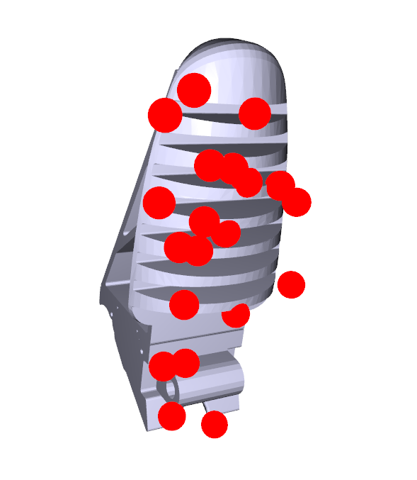

# Grasp poses generation for robotic hand


## INSTALLATION
### Preparation
We use Docker. For correct working with GPU on Docker you need install [NVIDIA Container Toolkit](https://docs.nvidia.com/datacenter/cloud-native/container-toolkit/latest/install-guide.html). It is installed in the host.

### Docker Container Creation
So let's start by creating a container.
1) Clone this repo to your system
```bash
git clone https://github.com/BE2R-Lab-RND-AI-Grasping/DexGraspNet.git
```
3) Go to the root folder of the repository and build a Docker container using the following command:
```bash
docker build --pull --rm -f 'Dockerfile' -t 'dexgraspnet:latest' '.'
```
3) To run this code in VS Code, use the `Reopen in Container` function.
4) When starting the container for the first time, you need to install TorchSDF (TorchSDF is a custom version of Kaolin)
```bash
cd thirdparty
git clone https://github.com/wrc042/TorchSDF.git
cd TorchSDF
bash install.sh
```

# CONTACT POINTS CREATION

To implement the differential force closer estimation method, you must define the contact points on the finger surfaces that interact with objects.



You can use `contact_points_creation.py`:

```text
grasp_generation_egorhand_edited_hand/
│
├── contact_points/               
│   ├── creation_Python/      
│   
```

In order to visualize the received contact points along with the hands models meshes, run the file `vizualization_contact_points.py` in the same directory.

# GRASP GENERATION
This code generates different optimized hand poses for objects and saves these values to an .npy file (a separate file for each object). These files are saved in the `data/graspdata` folder.

> Full dataset and object meshes you can find [HERE](https://mirrors.pku.edu.cn/dl-release/DexGraspNet-ICRA2023/). Files from `dexgraspnet.tar.gz` put to the folder `data/dataset`, Files from `meshdata.tar.gz` put to the folder `data/meshdata`

You should have the container running now. Run file:
```bash
cd grasp_generation/
export CUDA_VISIBLE_DEVICES=0
python scripts/generate_grasps_doker_runner.py --all
```
> We have one GPU, so `CUDA_VISIBLE_DEVICES=0`, if you have more GPUs write it in this form `export CUDA_VISIBLE_DEVICES=x,x,x` (instead `x` use your GPUs ID).

> The generation process takes a lot of time. It's fine if the progress bar shows 0%. For faster generation, you can leave several objects in the 'data/meshdata` folder.

> Adjust parameters `batch_size_each` to get the desired amount of data. Turn down `max_total_batch_size` if CUDA runs out of memory. Remember to change the random seed `seed` to get different results. Other numeric parameters are magical and we don't recommend tuning them.


EXAMPLE: `python scripts/generate_grasps.py --hand_name DIP-Flex_opened_kinematics --batch_size_each 100 --n_iter 1000 --object_code_list hummer_0 pliers_0 screwdriver_0`

