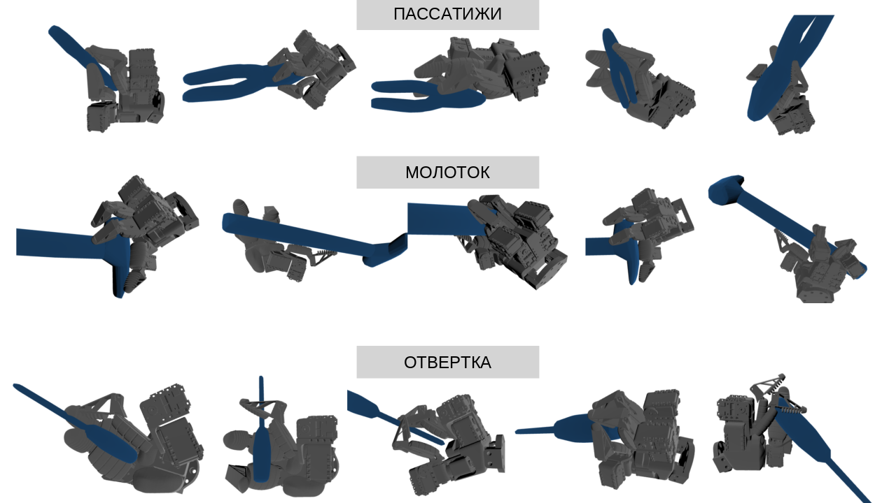

# How to visualize the generation results: hand + objects



## 1. INSTALLATION

Create new CONDA environment and install several libraries.

'''bash

conda create -n your_env python=3.7

conda activate your_env

conda install pytorch cpuonly -c pytorch

conda install ipykernel

conda install transforms3d

conda install trimesh

pip install pyyaml

pip install lxml

cd thirdparty/pytorch_kinematics

pip install -e .

'''

## 2. RUN
Then you can run 'quick_example.ipynb'.

## CONTENT

```text
ready_to_work/
├── dataset/ 
│   ├── DIP-Flex_opened_kinematics/
│      └── hummer.npy               # dataset with hand poses for hummer
├── meshdata/hummer/coacd/
│   └── decomposed.obj              # the file with the object model (hammer) 
├── model/                          # the folder with the hand model and meshes for it
├── thirdparty
│   └── pytorch_kinematics/         # library for pytorch
└── quick_example.ipynb             # the file to start the visualization
```